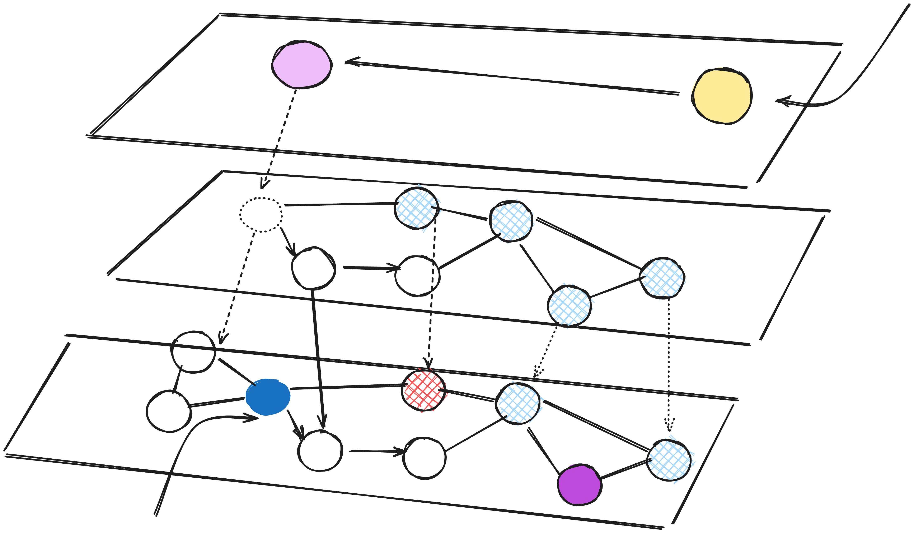

# How does the HNSW algorithm work

Layered representation of HNSW

## Background

The advancements in Semantic and Similarity search have caused a dynamic transformation in queries. Nowadays, more queries are made with natural language context, and the most relevant results need to be returned for the query.

Solr's latest release, version 9.x, now includes vector search capabilities with the HNSW similarity algorithm. This post is about my experience learning about HNSW while exploring Solr's vector search feature.

Hierarchical Navigable Small World (HNSW) graphs are is a state-of-the-art algorithm used for an approximate search of nearest neighbours. Under the hood, HNSW constructs optimised graph structures which can be used to create [index](https://en.wikipedia.org/wiki/Search_engine_indexing)[1] for the search.

> The main idea behind HNSW is to construct a graph in which a path between any pair of vertices can be traversed in a small number of steps.
> 

HNSW is a popular nearest neighbour search. And there are some pretty advanced data structure involved, i.e. Skip List and and navigable small world graphs

## Skip List

Skip list[2] is a probabilistic data structure that allows inserting and searching elements within a sorted list for *O(logn)* on average. A skip list is constructed by several layers of linked lists. The lowest layer has the original linked list with all the elements in it. When moving to higher levels, the number of skipped elements increases, thus decreasing the number of connections

Skip lists use multiple layers of linked lists. The first layer has links that skip many nodes/vertices. Each layer below has links that skip fewer nodes/vertices.

For lookup we start at the highest level and move to the next element if it's less than or equal to the value, or move down to the next layer with more connections if it's greater. Repeat until you reach the lowest layer and find the value.

## ****Navigable Small World Graphs****

Navigable small world[3] is a graph with poly logarithmic *T = O(logᵏn)* search complexity. 

The of starting the search process from low-degree vertices and ending with high-degree vertices is based on the greedy approach. We can move rapidly through the low degree vertices since they have few joining edges. This enables the algorithm to to efficiently navigate to the region where the nearest neighbour is likely to be located. Then the algorithm switches to high-degree vertices to find the nearest neighbour among the vertices in that region.

Assuming that Node A is the pre defined entry point, when we start searching the query, Node A chooses node E even if it having closer nodes C and B as query is closer to the node E. At node E, query is closer to node G, and finally at node G, node I is further closest to the query. Once all the neighbour is located and none of the neighbour is closer to the query than the node itself, it is returned as the result.

To identify the next vertex (or vertices) that the algorithm should proceed to, it computes the distances from the query vector to the neighbouring vertices of the current vertex and then advances to the nearest one. Eventually, the algorithm terminates the search process when it's unable to discover a neighbouring node that is closer to the query vector than the current node. The vertex where we terminated becomes the result of the query.

One notable point is, this approach doesn’t always guarantee that results would be returned for the query. If the nodes connected to entry points are farther away from the query, the current node is returned itself signifying the early stopping.

Here, both the vertices B and C are farther from the query than the starting point A. Hence lookup is terminated as early stopping.

To approach this limitation, many different starting points can be choosen.

## Hierarchal Navigable Small World

HNSW is a multi layered structure which is based on the same concepts of Skip lists and the navigable small world graphs.

Adding hierarchy to NSW produces a graph where links are separated across different layers. At the top layer, we have the longest links, and at the bottom layer, we have the shortest which also means that at the top we have fewer nodes and at the bottom there are many node.

Layered representation of HNSW

The concept behind our graph is to create a network of interconnected points, if we take a proximity graph but build it so that we have both long-range and short-range links, then search times are reduced to logarithmic complexity from polynomial.

The number of operations required to find the nearest neighbour on any layer is bounded by a constant. Taking into consideration that the number of all layers in a graph is logarithmic, we get the total search complexity which is *O(logn)*

While lookup we start at the top layer, where we find the longest links. These vertices will tend to be higher-degree vertices (with links separated across multiple layers), meaning that we, by default, start in the *zoom-in* phase (algorithm switching to high-degree vertices to find the nearest neighbour among the vertices in that region) as seen in the case of Navigable small world graph.

The traversal in the HNSW is as same as the NSW, greedily moving to the nearest vertex until we find a local minimum. Only difference here is we move to the current vertex in a lower layer as we have multiple layers and begin searching again. We repeat this process until finding the local minimum of our bottom layer — *layer 0*.

## The construction of HNSW graph

Understanding the construction of the HNSW graph is important to know if you are going to be using Solr for the vector search or any other Vector DB.

During graph construction, vectors are iteratively inserted one-by-one. The number of layers is represented by parameter *L*. The probability of a vector insertion at a given layer is given by a probability function f(level, mL).

**Influence of the construction parameters:**

> To achieve the optimum performance advantage of the controllable hierarchy, the overlap between neighbors on different layers (i.e. percent of element neighbors that are also belong to other layers) has to be small. — Yu. A. Malkov, D. A. Yashunin.
> 

Minimum the overlap of shared neighbors across layers, optimal the performance turns out to be. *Decreasing mL* can help minimize overlap (pushing more vectors to *layer 0*), but this increases the average number of traversals during search. So, we use an *mL* value which balances both. From the ANN Search using HNSW paper*[4] we can consider the* optimal value of *mL* which is equal to *1 / ln(M)*. 
Note, M is derived from the relation *p = 1 / M* of the skip list being an average single element overlap between the layers

Graph construction starts at the top layer. After entering the graph the algorithm greedily traverse across edges, finding the *ef* nearest neighbors to our inserted vector *q* — at this point *ef = 1*.

After finding the local minimum, it moves down to the next layer (just as is done during search). This process is repeated until reaching our chosen *insertion layer*. Here begins phase two of construction.

The *ef* value is increased to **efConstruction** (a parameter we set), meaning more nearest neighbors will be returned. In phase two, these nearest neighbors are candidates for the links to the new inserted element *q* *and* as entry points to the next layer.

*M* neighbors are added as links from these candidates — the most straightforward selection criteria are to choose the closest vectors.

Lets assume, Mmax = 3 and M maxo = 5. As more vertices are entered, edges upto Mmaxo can be created for Layer 0 and M max for Layer 1.  

After working through multiple iterations, there are two more parameters that are considered when adding links. *M_max*, which defines the maximum number of links a vertex can have, and *M_max0*, which defines the same but for vertices in *layer 0*.

Now once we have this understanding, how can we use this while building HNSW index in Solr?

| Solr Index time Parameter | Default | Description |
| --- | --- | --- |
| hnswMaxConnections | 16 | Lucene90HnswVectorsFormat only:Controls how many of the nearest neighbor candidates are connected to the new node.It has the same meaning as M from the paperhttps://arxiv.org/abs/1603.09320. |
| hnswBeamWidth | 100 | Lucene90HnswVectorsFormat only: It is the number of nearest neighbor candidates to track while searching the graph for each newly inserted node.It has the same meaning as efConstruction from the paperhttps://arxiv.org/abs/1603.09320. |

Ref:

1. Search Engine Index: [https://en.wikipedia.org/wiki/Search_engine_indexing](https://en.wikipedia.org/wiki/Search_engine_indexing)
2. Skip Lists: [https://en.wikipedia.org/wiki/Skip_list](https://en.wikipedia.org/wiki/Skip_list)
3. Navigable Small world: [https://en.wikipedia.org/wiki/Small-world_network](https://en.wikipedia.org/wiki/Small-world_network)
4. ANN Search using HNSW paper: [https://arxiv.org/pdf/1603.09320.pdf](https://arxiv.org/pdf/1603.09320.pdf)
5. Dense Vector field in Solr: [https://solr.apache.org/guide/solr/latest/query-guide/dense-vector-search.html](https://solr.apache.org/guide/solr/latest/query-guide/dense-vector-search.html)
